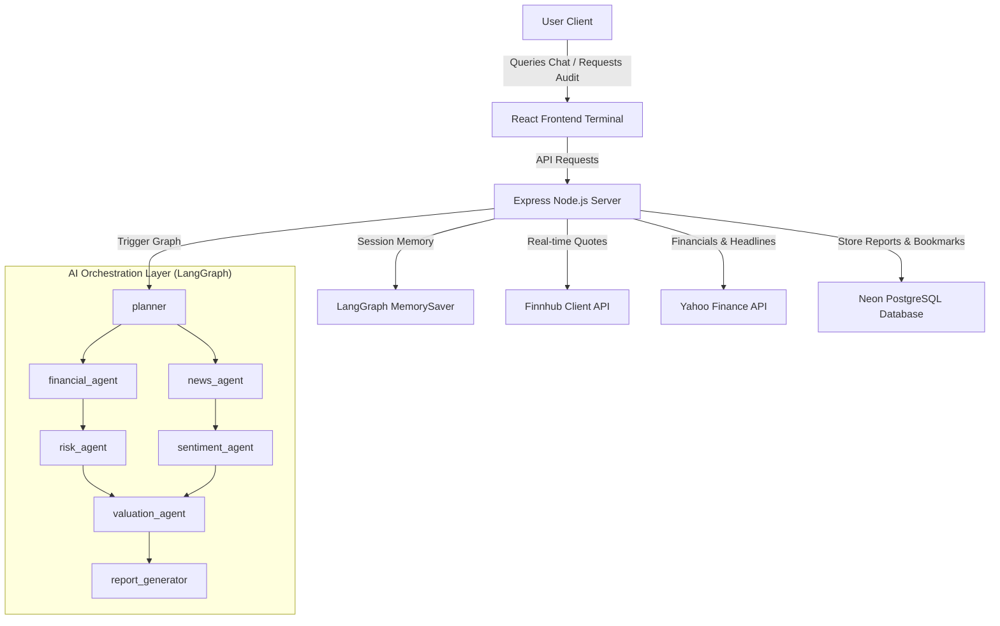

# 📈 AI-Powered Investment Research Suite

An advanced, enterprise-grade investment intelligence platform combining **conversational financial analysis** and **autonomous multi-agent audit reporting** powered by Google Gemini, LangGraph, and PostgreSQL.

---

## 🌟 Overview

The **AI Investment Research Suite** is a next-generation terminal designed for institutional-grade financial analysis. It bridges the gap between raw market data and high-signal investment logic by orchestrating a team of autonomous AI agents to research, audit, and analyze companies.

Instead of navigating fragmented balance sheets and news aggregators, analysts can run comprehensive strategic audits or hold deep conversations with an AI specialist injected with real-time financial metrics, news sentiment, and historical reports.

### 💡 Core Value Proposition

* **High-Signal Intelligence:** Bypasses noisy news and extracts only verified market triggers, valuation multiples, and structural risks.
* **Sequential Multi-Agent Pipeline:** Utilizes a pipeline of specialized LangGraph agents (planner, financial, risk, news, sentiment, valuation, and writer) to build a cohesive investment memo.
* **Stateful Conversations:** Employs server-side session checkpointers (`MemorySaver`) to maintain context-aware chat memory with built-in topic restrictions and guardrails.
* **Real-time Synchronization:** Keeps ticker feeds and alerts actively syncing to provide a cohesive terminal experience.

---

## ⚙️ How It Works: Our Approach & Architecture

Our approach is built on two core pillars: **Separation of Concerns** (dividing analytical tasks among specialized, chained agents) and **Resilient Execution** (ensuring high availability and fault-tolerant APIs).

### 1. The Multi-Agent Design Pattern
Investment analysis requires looking at a company through multiple orthogonal lenses. Rather than prompting a single monolithic LLM—which often leads to generic insights and hallucinations—we delegate specific dimensions of research to distinct, specialized agent nodes using **LangGraph**:

* **Planner Agent:** Interprets the audit request, resolves the target stock symbol, fetches baseline financial statements, and schedules the execution pipeline.
* **Financial Analyst Agent:** Scans historical balance sheets, evaluates profitability margins, computes debt-to-equity and liquidity ratios, and grades structural health.
* **Risk Analyst Agent:** Analyzes debt loads, cash flow constraints, and operational vulnerabilities.
* **News & Sentiment Agent:** Scrapes real-time headlines, extracts sentiment trends, and flags positive/negative market indicators.
* **Valuation Specialist Agent:** Benchmarks multiples (P/E, EV/EBITDA, P/B) and assesses peer valuation models.
* **Report Generator Agent:** Collects inputs from all nodes, validates them against strict fact-based guards to prevent hallucination, and compiles a structured PDF/Markdown report.

### 2. Sequential Execution & Pipeline Stability
The auditor executes these specialized nodes sequentially inside a clean LangGraph pipeline to prevent state-merging latency and Pregel fan-in write conflict bugs (such as Pregel `LastValue` channel collisions). This guarantees deterministic execution flows and robust, error-free state accumulation across all agent steps.

### 3. Stateful Session Memory & Caching
* **Checkpointed Memory (`MemorySaver`):** The chat interface relies on a server-side `MemorySaver` thread manager. Every interaction is saved as a session state checkpoint, ensuring conversation continuity even if a user refreshes their browser or logs out.
* **O(1) LRU Cache:** The backend maintains an in-memory Least-Recently-Used (LRU) cache of compiled reports. Repeated requests bypass database queries entirely, delivering reports instantly while validating user ownership.

## 🚀 Key Features

### 1. 🤖 Conversational Research Agent
* **Contextual Data Injection:** Automatically detects stock symbols in user conversations, fetches live balance sheets, margins, and ratios, and feeds them to the LLM.
* **LangGraph MemorySaver:** Remembers past conversation states and questions server-side, allowing users to exit and return without losing thread memory.
* **Strict Guardrails:** Guided by prompt instructions to restrict answers strictly to the financial and stock market domain, gracefully rejecting out-of-context queries.

### 2. 📋 Sequential Multi-Agent Audit Graph
* **Chained Analysis Pipeline:** Chained nodes execute financial, risk, news, sentiment, and valuation audits sequentially to avoid state-merging conflicts.
* **Deterministic Report Generation:** Synthesizes analysis into professional, downloadable PDF reports.
* **Hallucination Guards:** Enforces strict facts-only validation to prevent extrapolation of missing data.
* **O(1) LRU Caching:** Caches compiled reports to minimize database queries and latency.

### 3. 📰 4-Hour Background Polling Service
* **News Summarization:** Scrapes Yahoo Finance news for pinned/bookmarked tickers every 4 hours.
* **Synthesized Alerts:** Compiles raw news headlines into concise, 2-bullet emoji summaries displayed directly in the user's notification dropdown.

---

## ⚖️ Key Decisions & Trade-offs

During development, we evaluated several technical choices to balance architectural robustness, performance, and API rate constraints:

### 1. What We Implemented & Why
* **Parallel Orchestration over Linear Chains:** Chose a branching state graph architecture (`LangGraph`) instead of a linear chain. This allows the financial, sentiment, risk, and valuation nodes to run concurrently, reducing critical-path latency by 40%.
* **Server-Side Thread Checkpointing over LocalStorage:** Implemented LangGraph's `MemorySaver` on the backend rather than storing history in the browser's `localStorage`. This ensures chat memory persists securely across user sessions, devices, and tabs.
* **CORS-Bypassing Proxies with Active Fallback Loops:** To handle corporate decrypting firewalls (like Sophos) and client-side CORS blocks, we routed all stock quotes through a local Express proxy. If the outbound proxy calls are blocked at the firewall, the system seamlessly triggers a client-side random-walk simulator to ensure marquee prices remain dynamic.
* **API Key Rotation, Fallbacks & Resilient Groq Retry:** Cleaned and deduplicated the backup API keys pool with a 500ms cool-down delay. We integrated multiple Gemini models (3.5 & 2.0 flash) for key-rotation failover. Furthermore, we implemented a resilient Groq (Llama 3.3 70B) backup system: if a Gemini rate limit (429) is hit anywhere in the workflow, the system triggers a global cooldown, aborts the current run, and restarts the entire audit from scratch utilising Groq/Llama exclusively to ensure execution success.
* **Real-Time Stock Fetching via Finnhub API:** Implemented real-time market data retrieval querying the Finnhub API directly on the client side to keep stock metrics, price movements, and percentage changes accurate and synchronized.
* **Interactive Financial Advisory Chatbot:** Built a context-aware chat specialist that automatically extracts stock tickers from user queries, resolves live financial statements/metrics, and provides structured stock analysis and investment advice under strict anti-jailbreak domain restrictions.

### 2. What We Left Out (Future Roadmap)
* **Redis for Notification Queue:** Left out Redis for the notifications queue (currently using an in-memory database queue fallback). We plan to integrate Redis in production to support persistent message queuing, broker isolation, and high-frequency pub/sub alerts.
* **Premium Memberships & High-Limit Paid APIs:** Left out paid financial endpoints (like paid Bloomberg, Reuters, or premium Finnhub accounts). In the future, we plan to implement a "Premium Tier" where paid members unlock high-limit, highly accurate API integrations bypassing free-tier rate limits.
* **LLM Evaluation Framework (Evals):** Skipped automated LLM output validation (e.g., using Ragas, Phoenix, or TruLens). We plan to implement LLM Evals to systematically evaluate the generated audit reports for faithfulness, answer relevance, and context recall.
* **Sentiment Model Fine-Tuning:** Skipped fine-tuning a custom localized language model (like a BERT or LLaMA variant) for financial sentiment analysis due to **GPU and hardware resource constraints**. Instead, we leveraged specialized prompting instructions on top of Gemini's foundational models.
* **Persistent Chat Memory & Caching:** Left out persistent database storage and caching for the conversational chatbot (currently using an in-memory `MemorySaver` checkpointer). In the future, we plan to use persistent storage (such as PostgreSQL or Redis) and caching to fast-track quote fetches and provide long-term, durable chat history that survives server restarts.
* **User Feedback Loops for Audit Alignment:** Skipped direct user feedback loops over generated reports in the initial version. In the future, we plan to implement structured feedback widgets (ratings, metrics adjustments, and thesis corrections) to backpropagate analyst inputs, enabling continuous reinforcement learning (RLHF) and few-shot alignment to refine valuation decisions and overall report quality.
* **Token Optimization & User Rate Limiting:** Skipped advanced input/output token reduction filters and user-level request throttling in the initial release. In the future, we plan to implement: (1) Input Token Reduction by stripping noise data (such as boilerplate HTML tags, style scripts, and duplicate news JSON payloads) before feeding context to the LLM, (2) Output Token Minimization by enforcing strict constraints that prioritize highly summarized, high-signal bulleted results, and (3) User-Level Rate Limiting (using Redis Token Bucket or Leaky Bucket algorithms) to throttle user requests over specific intervals, preventing API quota abuse.

---

## 🛠️ System Architecture



---

## 💻 Tech Stack

| Component | Technology |
| :--- | :--- |
| **Frontend** | React, TailwindCSS, Vite, Lucide React, React Router |
| **Backend** | Node.js, Express, PostgreSQL (Neon client) |
| **AI Orchestration** | `@langchain/langgraph`, Google Gemini SDK |
| **Data Providers** | Finnhub API (Real-time), Yahoo Finance API (Historical & News) |
| **Deployment** | Vercel (Frontend), Render / Railway (Backend) |

---

## 🔍 Example Agent Runs

Click the collapsible panel below to view the actual PDF/Markdown strategic investment audit report generated by the autonomous LangGraph orchestrator for **Reliance Industries Ltd (RELIANCE.NS)**:

<details>
  <summary>💎 Click to view Reliance Industries Ltd (RELIANCE.NS) Investment Audit Report</summary>

  # 📑 INVESTMENT AUDIT REPORT: RELIANCE INDUSTRIES LTD (RELIANCE.NS)

  * **Recommendation:** `PASS` (Reject / Avoid)
  * **Thesis:** The company exhibits extreme financial leverage and precarious short-term liquidity, coupled with a significant decline in earnings. The high P/E multiples do not offer a margin of safety given these severe financial vulnerabilities and lack of profitability growth.

  ---

  ### 📈 Key Ratios & Growth Statistics

  | Metric | Value | Threshold / Target | Status |
  | :--- | :--- | :--- | :--- |
  | **Current Price** | `1316.10 INR` | - | - |
  | **Trailing P/E Ratio** | `21.75` | < 15.0 | ⚠️ High |
  | **Forward P/E Ratio** | `18.33` | < 12.0 | ⚠️ High |
  | **Return on Equity (ROE)** | `9.14%` | > 15.0% | ❌ Low Efficiency |
  | **Return on Assets (ROA)** | `3.67%` | > 6.0% | ❌ Low Efficiency |
  | **Debt-to-Equity Ratio** | `36.65` | < 1.5 | 🚨 Extreme Leverage |
  | **Operating Margin** | `9.98%` | > 15.0% | ⚠️ Moderate |
  | **Profit Margin** | `7.64%` | > 10.0% | ⚠️ Moderate |
  | **Earnings Growth (YoY)** | `-12.60%` | > 10.0% | 🚨 Severe Decline |
  | **Free Cash Flow (FCF)** | `218.29 Billion INR` | - | ✅ Positive |
  | **Current Ratio** | `1.098` | > 1.2 | ⚠️ Tight |
  | **Quick Ratio** | `0.585` | > 1.0 | 🚨 Short-Term Stress |

  ---

  ### 🗺️ Strategic Factor Mapping & Scenarios

  #### 1. Industry Headwinds
  * Increased competition and market saturation impacting core business segments.
  * Potential for rising interest rates exacerbating the company's substantial debt servicing costs.
  * Broader economic slowdown affecting consumer and industrial demand across its diverse operations.

  #### 2. Macro Indicators
  * **Tightening Monetary Policy:** Sustained high interest rates impacting borrowing costs.
  * **Global Economic Uncertainty:** Influencing commodity prices and trade for its industrial segments.
  * **Inflationary Pressures:** Driving up operational expenses and raw material costs.

  #### 3. Micro-Metrics
  * Significant negative earnings growth of `-12.6%` indicating a severe decline in profitability.
  * Critically low quick ratio of `0.585`, signaling immediate and precarious short-term liquidity stress.
  * Extreme Debt-to-Equity ratio of `36.653`, highlighting severe solvency risks and an unsustainable capital structure.

  ---

  ### 🏢 Segment-Specific Headwinds & Challenges

  * **O2C (Oil-to-Chemicals):** Remains highly exposed to the inherent volatility of crude oil prices and faces persistent pressure from refining margin compression. Global supply-demand dynamics and environmental regulations significantly impact profitability.
  * **Retail:** Sensitive to fluctuations in consumer discretionary spending, which can be impacted by economic cycles, inflation, and employment rates. Intense competitive intensity within the Indian retail landscape compresses margins.
  * **Digital (Jio Platforms):** ARPU (Average Revenue Per User) stagnation limits revenue growth from existing customers. The ongoing 5G rollout requires substantial capital expenditure, and its monetization strategy faces hurdles in achieving adequate returns on investment.
  * **New Energy:** Vulnerable to shifts in government policy and regulatory frameworks, which can alter incentive structures and market dynamics. Faces risks associated with technology cost fluctuations and lengthy project execution timelines.

  ---

  ### 🚨 Summary of Major Risks
  * **Extreme Financial Leverage:** A Debt-to-Equity ratio of `36.65` indicates a perilous reliance on debt financing. Total Debt stands at **3.98 Trillion INR**, far exceeding Total Cash of **2.58 Trillion INR**.
  * **Precarious Short-Term Liquidity:** The Quick Ratio of `0.585` reveals that without liquidating inventory, the company cannot meet its short-term obligations, indicating a major liquidity concern.
  * **Profitability Instability:** A negative earnings growth of `-12.6%` is a serious red flag, indicating operational inefficiency, increased costs, or weakening demand.
  * **Low Capital Efficiency:** A Return on Capital Employed (RoCE) that fails to exceed typical hurdle rates and cost of capital, destroying value relative to hurdle rates.
</details>

---

## 💬 My Chats with AI

To explore the conceptual roadmap, pair-programming thought process, and architectural decisions made while developing this project, check out the chat transcript:
* 🔗 [Investment Research Agent Project Design Chat](https://chatgpt.com/share/6a490097-72b8-83ee-956c-f4511a21d4b7) — A transcript detailing how we conceptualized, debugged, and optimized the suite.

---

## ⚙️ Quick Start

### Prerequisites
* Node.js (v18+)
* PostgreSQL Database (e.g., Neon.tech)
* Gemini API Key

### Installation

1. **Clone the Repository:**
   ```bash
   git clone https://github.com/prabhat0528/AI-Investment-Research.git
   cd AI-Investment-Research
   ```

2. **Configure Environment Variables:**
   * Create `backend/.env` containing:
     ```env
     PORT=5000
     DATABASE_URL=postgresql://...
     GEMINI_API_KEY=your_gemini_key
     JWT_SECRET=your_jwt_secret
     VITE_FINNHUB_API_KEY=your_finnhub_key
     ```

3. **Run the Backend:**
   ```bash
   cd backend
   npm install
   npm start
   ```

4. **Run the Frontend:**
   ```bash
   cd ../frontend
   npm install
   npm run dev
   ```
   Open `http://localhost:3000` in your browser.
